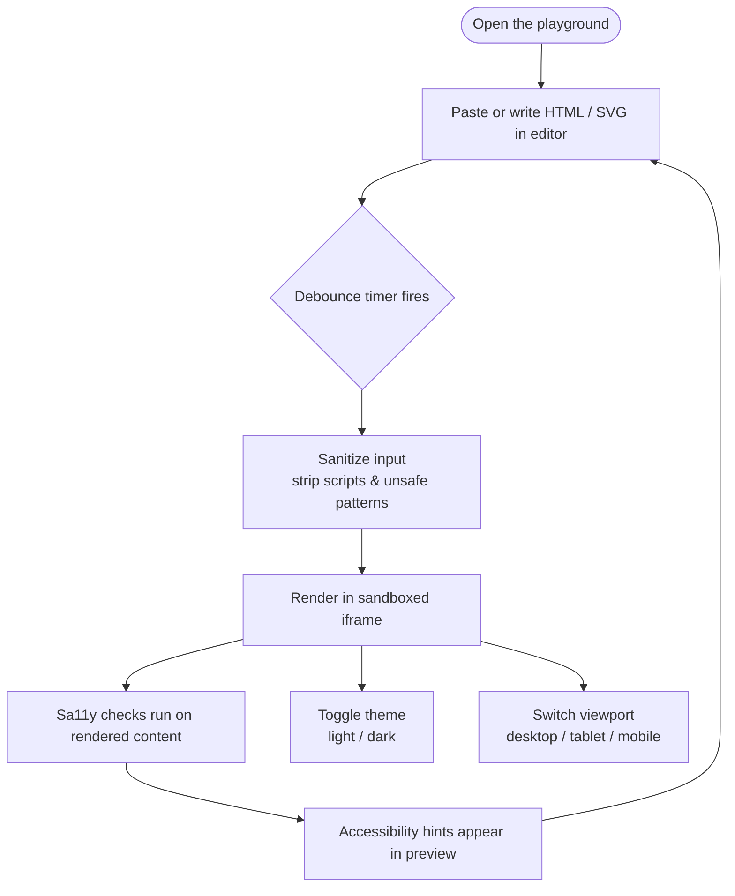

# Live Accessibility Playground

[](https://www.gnu.org/licenses/agpl-3.0)
[](https://github.com/mgifford/html2html/actions/workflows/accessibility.yml)
[](https://mgifford.github.io/html2html/)

A single-file HTML tool for testing raw HTML and inline SVG in real time, with instant accessibility feedback.

**[Open the Live Playground &rarr;](https://mgifford.github.io/html2html/)**

## How it works

Paste or write HTML and SVG in the editor. The app sanitizes your input and renders it live in an isolated `iframe`. [Sa11y](https://sa11y.netlify.app) runs automatically on every update and highlights accessibility issues directly in the preview.



## Who it can help

- Frontend developers testing components in isolation
- Accessibility specialists reviewing sample markup
- Designers validating light and dark presentation
- CMS teams experimenting with author-generated HTML
- Trainers teaching semantic HTML and common accessibility issues
- Anyone debugging SVG, forms, headings, images, or content structure

## Why it is useful

A lot of accessibility and frontend work happens before a full app or CMS integration exists. Sometimes you just need a fast place to answer questions like:

- Does this markup structure make sense?
- Does this SVG expose a useful accessible name?
- What does this component look like on mobile?
- Does this content still work in dark mode?
- Will this external CSS file behave the way I expect?
- Does Sa11y flag obvious issues before I ship this into a larger system?

Instead of setting up a framework, a build step, or a design system sandbox, you can paste markup directly into the editor and see the result immediately.

## Features

- Renders HTML and inline SVG live as you type
- Debounces updates to avoid excessive rerenders
- Injects Sa11y into the preview and reruns checks on refresh
- Lets external stylesheet links in the editor apply to the preview
- Blocks user-authored scripts for safer experimentation
- Supports swapping the editor and preview chrome between dark and light surfaces
- Lets you test the preview at desktop, tablet, and mobile widths
- Includes copy, clear, and download actions

## Example use cases

### 1. Accessibility QA for fragments

Paste a heading structure, form, table, card, or article snippet and see whether Sa11y catches obvious issues such as missing labels, heading problems, or weak content patterns.

### 2. SVG testing

Drop in inline SVG and verify how titles, roles, and accessible names behave while keeping the visual output visible beside the source.

### 3. CSS framework experiments

Link to Bootstrap, Tailwind, or another stylesheet CDN in the editor and quickly test how a content block behaves without creating a full project.

### 4. Responsive review

Switch between desktop, tablet, and mobile preview widths to spot layout issues early.

### 5. Light and dark mode checks

Toggle preview theme modes to see whether your markup and CSS still read clearly across different presentation contexts.

## Safety model

The app uses a sandboxed `iframe` as the preview surface:

- User CSS is isolated from the editor UI
- The preview can be rebuilt cleanly on each change
- Sa11y can run against the rendered document
- User-provided JavaScript is stripped while internal checking logic still runs

Script tags, inline event handlers, and unsafe URL patterns are removed before the preview is generated.

## Quick start

### Use the hosted version

Open the playground directly in your browser — no install needed: **[mgifford.github.io/html2html](https://mgifford.github.io/html2html/)**

### Run locally

Because this is a single HTML file, you can also open it directly:

1. Clone the repository
2. Open `index.html` in a browser

Or serve it from any local static server if you prefer.

## Running tests locally

The project uses [axe](https://github.com/dequelabs/axe-core) and [Playwright](https://playwright.dev) to verify accessibility of the shipped interface.

```bash
npm install
npx playwright install chromium
npm run test:a11y
```

The scan checks the app shell and key preview states for axe violations. CI runs the same check on every push and pull request.

## Notes and limitations

- Dark mode preview sets a dark page context, but a full dark-mode result still depends on the user's own CSS
- External CSS links are allowed in the preview, but third-party user JavaScript is intentionally blocked
- This is a lightweight playground, not a full replacement for browser testing, screen reader testing, or production security review

## Future directions

Possible enhancements include:

- Side-by-side dual previews for light and dark mode at the same time
- Saving and loading example snippets
- More explicit sanitization reporting
- Additional accessibility testing integrations
- Shareable URLs for saved examples

## License

[GNU Affero General Public License v3.0](LICENSE)
